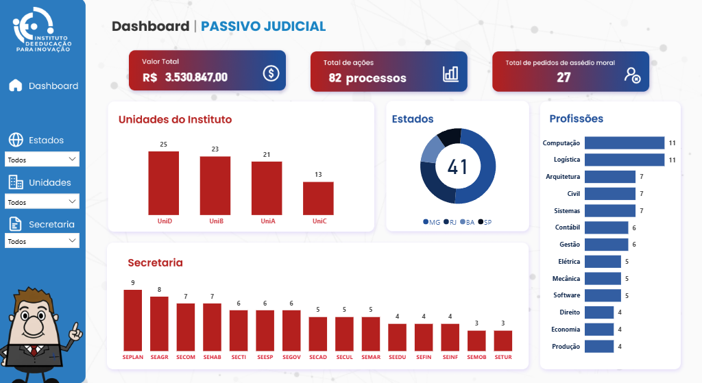

# 📊 Dashboard de Monitoramento de Passivo Judicial

> 🔒 **Dados anonimizados:** Este projeto utiliza dados tratados e anonimizados para garantir a confidencialidade das informações.

## 📷 Preview do Dashboard

---

## 🎯 Objetivo

Este projeto consiste no desenvolvimento de um dashboard interativo no Power BI voltado à análise e ao monitoramento de passivos judiciais em uma fundação privada sem fins lucrativos.

O objetivo é apoiar a tomada de decisão por meio de insights baseados em dados, permitindo a identificação de padrões, gargalos e distribuição dos processos.

---

## 🛠️ Ferramentas Utilizadas

* Power BI (visualização de dados)
* Excel (tratamento e estruturação dos dados)

---

## 📊 Principais Métricas

* 💰 Valor total do passivo judicial
* 📄 Total de processos
* ⚖️ Total de pedidos de assédio moral

---

## 📈 Análises Realizadas

O dashboard permite a análise dos processos judiciais sob diferentes perspectivas:

* 🏢 Unidades do instituto
* 🌎 Estados
* 🏛️ Secretarias
* 👨‍💼 Profissões

---

## 🔍 Tratamento de Dados

Os dados utilizados neste projeto foram anonimizados para garantir a confidencialidade das informações.

Principais etapas:

* Limpeza e padronização dos dados
* Tratamento de inconsistências
* Organização das tabelas para análise

---

## 💡 Principais Insights

* Identificação das unidades com maior volume de processos
* Concentração de ações em determinados estados
* Distribuição das demandas por área profissional
* Mapeamento das secretarias mais impactadas

---

## ⚠️ Considerações
Este projeto foi desenvolvido com dados anonimizados e pode não refletir integralmente cenários reais, sendo utilizado para fins de análise e demonstração de habilidades em dados.

---
